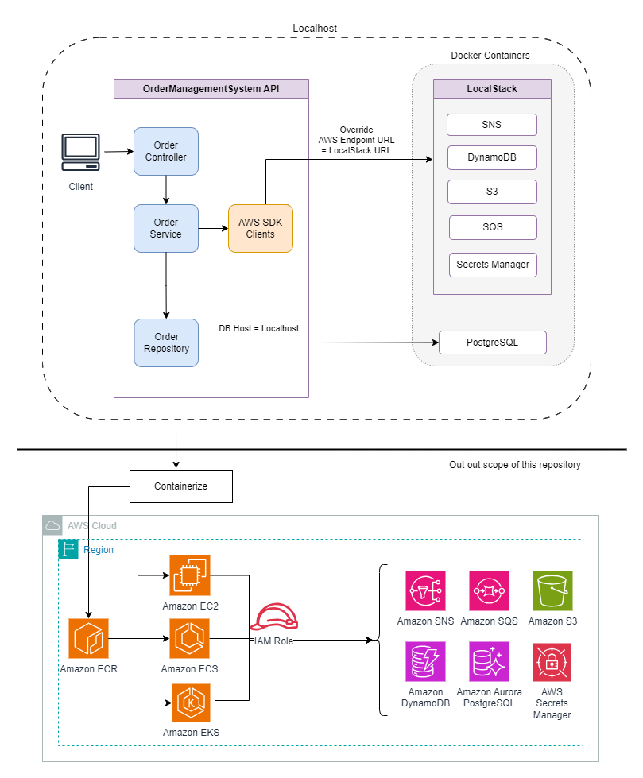

# LocalStack AWS Dev Kit for .NET

This project provides a reference implementation for setting up a local AWS cloud stack using LocalStack, with automated resource creation for Amazon Simple Storage Service (S3), Simple Queue Service (SQS), Simple Notification Service (SNS), and DynamoDB. The project includes a sample Web API (Order Management System) that connects to a local PostgreSQL database created using Flyway migrations.

Treat this code as a proof of concept (POC) and not for production use.

This implementation works with both LocalStack and AWS Services. Apply the security recommendations in the 'Security' section before using in your solution.

This repository does not cover AWS resource creation for real AWS accounts.
Follow AWS security best practices when provisioning AWS resources:
https://docs.aws.amazon.com/prescriptive-guidance/latest/terraform-aws-provider-best-practices/security.html

## Key Benefits

- Cost Savings: Develop and test without AWS charges.
- Fast Development: Speed up feedback loops with local services.
- Easy Testing: Create repeatable, isolated tests with mock AWS services.
- AWS Compatibility: Run the same code with real AWS services.
- Full Stack Emulation: Use S3, SNS, SQS, DynamoDB, and PostgreSQL locally.
- CI/CD Friendly: Set up automated testing with lightweight Docker.
- Team Consistency: Provide uniform environments for all developers.

## Architecture



## Table of Contents
- [Prerequisites](#prerequisites)
- [Environment Configuration](#environment-configuration)
- [Quick Start](#quick-start)
- [API Usage Examples](#api-usage-examples)
- [Docker Commands](#docker-commands)
- [Infrastructure Components](#infrastructure-components)
- [Health Checks](#health-checks)
- [Database Management](#database-management)
- [LocalStack AWS Commands](#localstack-aws-commands)
- [References](#references)
- [Security](#security)
- [License](#license)

## Prerequisites

- Docker
- Docker Compose
- AWS CLI (optional - for local testing)
- .NET Runtime and SDK (version 8 or later)
- Visual Studio 2022 (optional)

## Hardware Requirements

- Processor: 64-bit processor
- RAM: 8 GB or more
- Storage: 40 GB or more

## Environment Configuration

The application retrieves database credentials and API Key from AWS Secrets Manager. For local development with LocalStack, configure these values in the `infra/local/.env` file. The default configuration contains placeholders you must replace with actual values.

1. Locate the placeholders in the configuration:
   ```json
   DATABASE_CREDENTIALS_SECRET_STRING={"Host": "database","Database":"order-management-system", "Port": "5432", "Username": "postgres", "Password": "<DB_PASSWORD>"}
   API_KEY_SECRET_STRING={"ApiKey":"<API_KEY>"}
   ```
   
2. Replace `<DB_PASSWORD>` and `<API_KEY>` with your actual values.

The database 'host' value differs between environments:
- For localhost: Use `"host":"localhost"` in the connection string
- For Docker: Use `"host":"database"` in the connection string (container name in docker-compose)

Set the database password using one of these methods:
- Add `DATABASE_PASSWORD=your_db_password` in the '.env' file
- Pass as an environment variable to the docker compose command
- Use a base-64 encoded password string and decode it when constructing the connection string (recommended for security)

## Quick Start

1. Clone the repository
2. Update environment variables in `infra/local/.env` file
3. Build the docker image for the sample web API:
   ```bash
   docker build -t localstack-demo .
   ```
4. Start the containers:
   ```bash
   docker-compose -f ./infra/local/docker-compose.yml --profile all up -d --wait
   ```
5. Verify the containers are running:
   ```bash
   docker-compose ps
   ```

## API Usage Examples

### Create new Order

**Bash**
```bash
curl -X POST "http://localhost:7126/api/orders" -H "Content-Type: application/json" -H "ApiKey: <your-api-key>" -d '{
  "customerId": "4638e60b-e741-4e3b-b7f3-37419a5c8ad6",
  "totalAmount": 7000
}'
```

**Windows Command Prompt**
```
curl -X POST "http://localhost:7126/api/orders" -H "Content-Type: application/json" -H "ApiKey: <your-api-key>" -d "{\"customerId\":\"4638e60b-e741-4e3b-b7f3-37419a5c8ad6\", \"totalAmount\": 5000}"
```

## Docker Commands

```bash
# Build Web API Docker Image
docker build -t localstack-demo .

# Clean build (ignoring cache)
docker build --no-cache -t localstack-demo .
```

```sh
# Start Only Infrastructure (DB & LocalStack)
docker-compose -f ./infra/local/docker-compose.yml --profile infra up -d --wait

# Start Only Database
docker-compose -f ./infra/local/docker-compose.yml --profile db up -d --wait

# Start All Services (Including App)
docker-compose -f ./infra/local/docker-compose.yml --profile all up -d --wait

# Terminate All Services
docker-compose -f ./infra/local/docker-compose.yml --profile all down
```

## Infrastructure Components

### LocalStack
- Runs as a docker container
- Simulates AWS cloud services locally
- Accessible at `localhost:4566`
- Services: S3, SQS, SNS, DynamoDB, Secrets Manager

This repository does not include infrastructure code (Terraform or CloudFormation) for AWS account deployment.

### PostgreSQL Database
- Runs as a docker container
- Initializes automatically with credentials from 'infra/local/.env'
- Persists data in a docker volume

### Flyway Migration Scripts
- Auto-executes through the Flyway service docker container
- Enables schema evolution with versioned and repeatable scripts
- Configuration:
  - Migration files location: `./flyway/sql`
  - Automatic baseline on migrate enabled
  - 10 connection retries
  - Connects to: `jdbc:postgresql://database/${DATABASE_NAME}`

## Health Checks

- API health check endpoints: 
  - http://localhost:8080/health (Docker) 
  - http://localhost:5128/health (Visual Studio)
- LocalStack health check endpoint: 
  - http://localhost:4566/_localstack/health
- PostgreSQL health check uses the shell command: `pg_isready` 
- Flyway scripts execute only after the database is created and healthy

## Database Management

### Database Connection

Connect to the Order-management-system database using any PostgreSQL-compatible DB client.

To connect from Docker Desktop UI:
1. Open Docker Desktop
2. Go to the "Containers" tab
3. Find your database container: `${COMPOSE_PROJECT_NAME}-database`
4. Click on the container
5. Go to the "Terminal" tab
6. Connect to PostgreSQL:
   ```bash
   psql -U ${DATABASE_USER} -d ${DATABASE_NAME}
   ```

### Database Queries

```sql
-- List all tables
SELECT * FROM pg_catalog.pg_tables WHERE schemaname = 'oms';

-- View customers
SELECT * FROM oms.customers;

-- View orders
SELECT * FROM oms.orders;

-- Join query to see customer orders
SELECT 
    c.name,
    o.id as order_id,
    o.total_amount,
    o.status
FROM oms.customers c
JOIN oms.orders o ON c.id = o.customer_id;
```

### Database Migrations

To add new database migrations:

- Create new SQL files in `./flyway/sql` folder and restart the containers to apply them
- Follow Flyway naming conventions: 
  - Versioned migrations: `V{version}__{description}.sql`
  - Repeatable migrations: `R__{description}.sql`

Learn more about Flyway migrations at: 
https://documentation.red-gate.com/fd/migrations-271585107.html

## LocalStack AWS Commands

Execute these commands from within the LocalStack container.

### SQS Commands

```bash
# List all SQS queues
awslocal sqs list-queues

# Receive message from queue
awslocal sqs receive-message --queue-url "http://sqs.us-east-1.localhost.localstack.cloud:4566/000000000000/order-queue"
```

### SNS Commands

```bash
# List all SNS topics
awslocal sns list-topics

# List all SNS subscriptions
awslocal sns list-subscriptions

# Publish message to Topic
awslocal sns publish --topic-arn "arn:aws:sns:us-east-1:000000000000:order-topic" --message "{\"Key\":\"sample\"}}"
```

### S3 Commands

```bash
# List S3 bucket content
awslocal s3 ls s3://order-bucket --recursive

# Copy a file from S3 bucket
awslocal s3 cp s3://order-bucket/orders/6.json .
```

### DynamoDB Commands

```bash
# List all DynamoDB tables
awslocal dynamodb list-tables

# Scan a DynamoDB table
awslocal dynamodb scan --table-name order-metadata
```

### Secrets Manager Commands

```bash
# Get Secret
awslocal secretsmanager get-secret-value --secret-id oms-api-key
```

## References
- [LocalStack](https://docs.localstack.cloud/overview/)
- [Flyway](https://documentation.red-gate.com/flyway/getting-started-with-flyway)

## Security FAQ

[Security Recommendation and FAQ](FAQ.md)

## Security

See [CONTRIBUTING](CONTRIBUTING.md#security-issue-notifications) for more information.

## License

This library is licensed under the MIT-0 License. See the LICENSE file.
